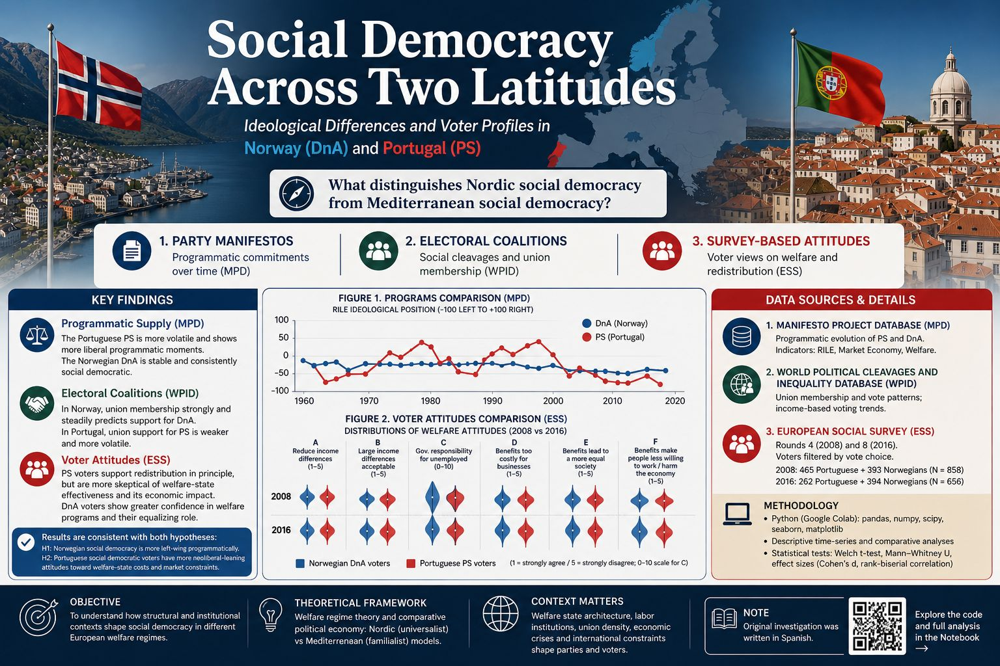
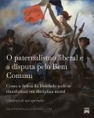
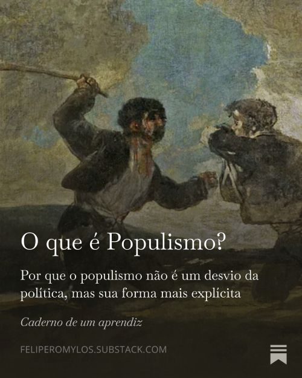

# Portfolio

## About me
I’m a Brazilian student based in Spain, currently pursuing a **Double Degree in Political Science and Sociology** at **Universidad Carlos III de Madrid (UC3M)**.

My main interests are **quantitative sociology**, **public opinion research** and **political behavior**, with a focus on how social attitudes and institutions shape political outcomes.  

I enjoy working with survey data, building indicators, and transforming complex datasets into clear insights and visualizations.

---

## 🔍 Areas of Interest

- Public opinion & survey analysis (CIS, ESS, WVS)
- Trust in institutions, ideology, and political culture
- Authoritarian attitudes and social cohesion
- Inequality, territory, and urban sociology

  ## 🛠 Technical Skills

### Data Analysis
- **Python** (Pandas, NumPy, Matplotlib, Plotly, Seaborn)
- **R** (Tidyverse, ggplot2, survey analysis workflows)
- **Statistical modeling** (regression, indexes, exploratory analysis, hypothesis tests)

### Visualization & Dashboards
- **Excel** (advanced formulas, pivot tables, PowerQuery, VBA/macros)
- **PowerBI** (interactive dashboards)
- Data storytelling and reporting

### Data Workflow
- Data cleaning, recoding, missing values handling
- Index construction (scale building, Cronbach’s alpha, PCA)
- Reproducible analysis with notebooks and scripts

---

## 📌 Featured Projects
*(Selected work will be added soon. Some projects are based on university research and personal studies.)*

>**_Note:_** Click on the image for full overview

  

---

## ✍️ Writing & Essays
I explore sociological and political themes, connecting theory with contemporary issues.

> **Note:** The following essays are written in **Portuguese**.

---

  <ins><b>The Right to Vote and Elitist Democracy</b></ins> 
  <i>(O direito ao voto e a democracia elitista)</i>

This essay examines the vital importance of expanding the suffrage against the resurgence of elitist democratic theories. Drawing on the works of **Adam Przeworski** and **Hannah Pitkin**, I discuss how representation and deliberative democracy serve as essential tools to counter the "competent minority" myth, ensuring that political power remains grounded in popular sovereignty.

  

---

  <ins><b>Liberal Paternalism and the Struggle for the Common Good</b></ins> 
  <i>(O paternalismo liberal e a disputa pelo bem comum)</i>

I explore the paradox of how discourses centered on individual liberty can devolve into a form of liberal paternalism. By analyzing some historical trends that mandate specific institutions as prerequisites for freedom, I argue for a reframing of liberty that connects the "good life" with the pursuit of a collective common good and civic virtue.

  

---

  <ins><b>What is Populism?</b></ins> 
  <i>(O que é populismo?)</i>

In this article, I challenge the overused and often misunderstood label of "populism" in contemporary political discourse. Grounded in the post-structuralist perspective of **Ernesto Laclau** and **Chantal Mouffe**, I analyze the conceptual construction of the "people" and apply this framework to understand the rise of **Bolsonarismo** as a specific political logic rather than a mere pathology.

  

---

  📚 <b>Check out all my articles on <a href="https://feliperomylos.substack.com">Substack</a></b>

---

## 🌍 Languages
- Portuguese (Native)
- Spanish (C1)
- English (C1)

---

## 📫 Contact
- LinkedIn: <b><a href="https://www.linkedin.com/in/felipe-romylos-robotton-bethanis-6070a628b">Felipe Romylos Robotton Bethanis</a></b>
- Email: *frrbethanis@gmail.com*
